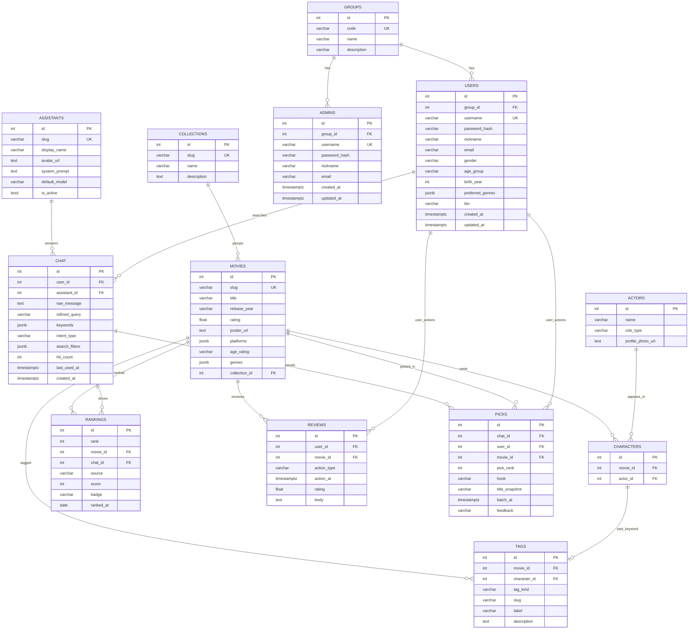

# Mova ERD

`suvisdev/apps/mova` ORM 기준 **Mova DB** 테이블 구조입니다.  
회원·인증·프로필은 **`viewer`** 모듈 — **`groups` · `admins` · `users` 3테이블**. env는 `SECOM_DATABASE_URL` (**미설정 시 Mova와 동일 DB**).  
`chat` / `reviews` / `picks`의 `user_id`는 **`users.id` FK** (관리자는 `admins` — Mova FK 없음).

> **2026-06 변경:** `members`·`user_groups` 제거. 권한은 **`groups`** + **`admins`** / **`users`** 분리 (총 3테이블).

## DB 이름·역할 (정리)

| 구분 | 설명 |
|------|------|
| **접두어 `mova_` 없음** | 테이블명은 `movies`, `actors`처럼 **짧은 영문 단수**만 씀. `mova_movies` 같은 중복 접두어는 쓰지 않음. |
| **Mova DB** | 영화·랭킹·태그·AI 의도·리뷰·상호작용. env: `MOVA_DATABASE_URL` 또는 `DATABASE_URL`. |
| **Secom DB** (`viewer`) | **권한·계정 3테이블** — `groups`, `admins`, `users` |
| **`groups`** | 그룹 코드 `admin` \| `user` (역할 정의) |
| **`admins`** | 관리자 계정 — `group_id` → `groups`(admin) |
| **`users`** | 일반 사용자 + **Mova 프로필** — `group_id` → `groups`(user). Mova AI 페르소나는 **`assistants`** |
| **admin / user 분리** | 공개 가입 → `users`만 · 관리자 → `admins` 시드 (`seed_admin_if_empty`) |
| **PK 규칙** | 모든 테이블 PK 컬럼명은 `id` (int 자동 증가). 비즈니스 키는 `slug`, `username` 등 별도 UNIQUE. |
| **HOT 랭킹** | UI 기본은 **`chat` 검색·추천 집계** (`source=chat_trend`). KOFIC 박스오피스는 **`source=box_office`** 별도 스냅샷. |

Mermaid `erDiagram`은 속성·관계 라벨의 **따옴표·괄호·슬래시** 등에서 파싱 오류가 날 수 있습니다. 필드 설명은 아래 표를 참고하세요.

## 전체 ERD (영화 카탈로그 + 채팅 + 회원)

기존 9테이블 레이아웃에 **`groups` · `admins` · `users`** · `assistants`를 같은 스타일로 합친 다이어그램입니다.


**단일 출처:** ERD 다이어그램은 **이 파일의 mermaid 코드 블록만** 수정합니다. 별도 `.mmd` 파일은 두지 않습니다.

**PNG 재생성** (블록 수정 후):

```powershell
# PNG 미리보기: 동일 폴더 `mova-erd.png` (재생성 스크립트는 미포함)
```



### groups · admins · users (3테이블)

| 테이블 | `groups.code` | 생성 경로 |
|--------|---------------|-----------|
| **`groups`** | `admin`, `user` | `seed_groups_if_empty()` |
| **`admins`** | `admin` (FK) | **`seed_admin_if_empty()`** — `admins`가 비어 있을 때만 1명 |
| **`users`** | `user` (FK) | 공개 회원가입 API (`users`만) |

**관리자 시드**

| 항목 | 값 |
|------|-----|
| 함수 | `viewer.app.dtos.admin_model.seed_admin_if_empty()` |
| startup 래퍼 | `seed_secom_if_empty()` |
| CLI | `python scripts/seed_admin_user.py` |
| 통합 시드 | `python scripts/add_members_and_assistants.py` (groups + admin + assistants) |

**기본 관리자** (`admins` 테이블, 환경변수 미설정 시):

| 필드 | 기본값 |
|------|--------|
| `username` | `admin` (`SECOM_ADMIN_USERNAME`) |
| `password` | `admin1234` (`SECOM_ADMIN_PASSWORD`) |
| `nickname` | `Mova Admin` (`SECOM_ADMIN_NICKNAME`) |
| `email` | `admin@mova.local` (`SECOM_ADMIN_EMAIL`) |
| `group_id` | `groups.code=admin` |

- `admins`에 행이 있으면 **스킵**
- Mova `chat`·`reviews`·`picks` FK는 **`users.id`만** (관리자는 별도)

**제거된 테이블:** `members` · `member_groups` · **`user_groups`** · `chat.member_id` · `users.role`

### 성별·연령대 코드 (`users` 프로필)

| gender | 설명 |
|--------|------|
| `male` | 남성 |
| `female` | 여성 |
| `other` | 기타 |
| `undisclosed` | 미입력 |

| age_group | 설명 |
|-----------|------|
| `10s` ~ `50s` | 10대 ~ 50대 |
| `60s_plus` | 60대 이상 |
| `undisclosed` | 미입력 |

## DB 범위

| DB | env 변수 | 테이블 |
|----|----------|--------|
| Mova | `MOVA_DATABASE_URL` 또는 `DATABASE_URL` | `movies`, `actors`, `characters`, `tags`, `rankings`, **`assistants`**, `chat`, `picks`, `reviews` |
| Friday13th (Secom) | `SECOM_DATABASE_URL` (미설정 시 Mova와 **동일 URL**) | **`groups`**, **`admins`**, **`users`** — Mova FK는 `users`만 |

## 관계

| 관계 | 카디널리티 | 설명 |
|------|------------|------|
| MOVIES → CHARACTERS | 1:N | 영화–배우·감독 연결 (`movie_id` → `movies.id`, CASCADE) |
| ACTORS → CHARACTERS | 1:N | 동일 중간 테이블 (`actor_id` → `actors.id`, CASCADE) |
| MOVIES ↔ ACTORS | N:M | `characters` 경유, `(movie_id, actor_id)` UNIQUE |
| MOVIES → TAGS | 1:N | 영화 키워드 (`tag_kind`: mood / genre / cast) |
| CHARACTERS → TAGS | 1:0..1 | `tag_kind=cast` 일 때 `character_id` FK — 영화–인물 연결을 검색 키워드로 노출 |
| TAGS (slug) | (논리 그룹) | mood: 같은 `slug`로 여러 영화에 동일 감성 태그 · genre: `genre-{장르}` · cast: `cast-{이름}` |
| MOVIES → RANKINGS | 1:N | HOT 랭킹 — **`chat`·`picks` 집계** 또는 KOFIC import 스냅샷 |
| CHAT → RANKINGS | 1:N | `rankings.chat_id` — 해당 순위를 만든 **대표 검색 의도** (nullable, `source=chat_trend`일 때) |
| CHAT → PICKS | 1:N | AI가 한 번에 추천한 작품 (보통 3행, `batch_at`으로 묶음) — **랭킹 집계의 입력** |
| MOVIES → PICKS | 1:N | 추천된 `movie_id` FK |
| MOVIES → REVIEWS | 1:N | 찜·시청·클릭·별점 리뷰 (`action_type`, `movie_id` FK) |
| USERS → REVIEWS | 1:N | `reviews.user_id` → `users.id` FK (`ON DELETE CASCADE`) |
| USERS → CHAT | 1:N | `chat.user_id` → `users.id` FK (`ON DELETE SET NULL`, 비로그인 NULL) |
| USERS → PICKS | 1:N | `picks.user_id` → `users.id` FK (`ON DELETE SET NULL`) |
| ASSISTANTS → CHAT | 1:N | `chat.assistant_id` → `assistants.id` — 응답 AI 페르소나 |
| REVIEWS (action_type=review) | 1:1 per user+movie | 별점·감상평 — `(user_id, movie_id)` partial UNIQUE |

**다이어그램에 선 없음 (DB FK·교차 테이블 아님, 앱 검색만):**

| 연결 | 설명 |
|------|------|
| CHAT → TAGS | `keywords`·`search_filters.must`로 `tags` 검색 (use) |
| CHAT → ACTORS | `search_filters`·`characters` 조인으로 배우 검색 (use) |
| CHAT → MOVIES | `search_filters`·`keywords`로 `movies` 조회 (use). 결과 FK는 **`picks`만** |

### 채팅 추천 흐름 (예: "오늘 우울하니까 재미있는 영화 틀어줘")

```text
사용자 메시지
    → IntentExtraction (refined_query, keywords 예: "재미있는", "우울")
    → chat 저장 (keywords, intent_type, search_filters JSONB)
    → SearchRepository: intent_type·search_filters(must AND) 또는 keywords로 tags·actors·movies 검색
    → Gemini: [태그·DB 카탈로그] 목록에서 3편 picks
    → movies 테이블에 제목 저장·메타 보강
```

| 단계 | 테이블 | 설명 |
|------|--------|------|
| 1. 의도 추출 | (메모리) | "재미있는", "우울" 등 키워드 분리 — **자동으로 tags 행을 만들지는 않음** |
| 2. 의도 이력 | `chat` | `keywords`, `refined_query`, `intent_type`, `search_filters` 저장 |
| 3. 태그 매칭 | `tags` → `movies` | `tags.label` ILIKE `%재미있는%` 등 (`GET /mova/search`와 동일) |
| 4. 추천 | `movies` | Gemini가 3편 제목 반환 후 `movies` upsert |
| 5. 추천 기록 | `picks` | `chat_id` + `movie_id` + 순위·hook 저장 (데이터화) |
| 6. 랭킹 스냅샷 | `rankings` | `picks`·`chat.hit_count` 집계 → `source=chat_trend` 일별 TOP N (`chat_id` = 대표 의도) |

### HOT 랭킹 — chat 연동 (목표 설계)

현재 코드는 KOFIC import 시 `movies.id`만으로 `rankings`를 채웁니다.  
**목표:** UI HOT 랭킹은 **채팅에서 실제로 많이 검색·추천된 작품**이 올라가고, `rankings`가 **`chat`과 FK로 묶여** “왜 1위인지”를 보여줍니다.

```text
chat (refined_query, hit_count, keywords)
  └── picks (chat_id, movie_id, pick_rank, batch_at)
        └── [집계] movie_id별 score
              └── rankings (movie_id, chat_id, source=chat_trend, score, rank, ranked_at)
```

| `source` | 의미 | `chat_id` |
|----------|------|-----------|
| `chat_trend` | 채팅 검색·AI 추천 집계 (UI 기본) | 해당 영화 점수에 기여한 **대표 `chat.id`** (예: `refined_query` 표시용) |
| `box_office` | KOFIC 일간·주간 박스오피스 import | NULL |
| `manual` | 관리자 수동 지정 | NULL |

**집계 score 예시** (구현 시 택1 또는 가중 합):

| 신호 | 출처 | 가중 |
|------|------|------|
| 추천 노출 | `picks` 행 수 (기간 내) | `pick_rank` 역순 (1위 pick = 3점) |
| 검색 빈도 | `chat.hit_count` (picks와 join) | 동일 `chat_id`마다 가산 |
| 최근성 | `picks.batch_at` / `chat.last_used_at` | 최근 7일 가중 |

**API:** `GET /mova/rankings/hot?source=chat_trend` (기본) · `source=box_office` (박스오피스 탭).

**제약 변경:** `(rank, ranked_at)` UNIQUE → **`(rank, ranked_at, source)` UNIQUE** — 같은 날 채팅 랭킹과 박스오피스 랭킹 공존.

기존 DB에 `rankings`에 `chat_id`·`source`가 없으면 `suvisdev/scripts/add_rankings_chat_source.py` 1회 실행.

**전제:** "재미있는"으로 찾으려면 DB `tags`에 그 `label`(또는 비슷한 문구)이 **어떤 영화에든** 붙어 있어야 합니다. 없으면 검색 결과가 비고 Gemini만으로 추천합니다.

**카탈로그 시드:** `suvisdev/scripts/seed_mova_recommendation_catalog.py` — mood·genre 태그, **cast 태그**(`characters` 연결 후 `character_id` FK).

### tags vs chat (저장 구조)

| | `tags` | `chat` |
|--|--------|--------|
| **역할** | 작품별 **감성 라벨** (`movie_id` FK) | 사용자 **채팅 의도·분류** 로그 |
| **영화 연결** | `movie_id` FK | 없음 — `picks.movie_id`로 결과만 연결 |
| **분류** | 없음 | `intent_type` (`filter_and` / `similar_person` / `mood`) |
| **AND 조건** | 없음 | `search_filters.must` (actors, genres, keywords) |
| **검색 바** | `GET /mova/search` | `POST /mova/chat` — `search_by_filters` 또는 키워드 검색 |

`CHAT`과 `tags`·`actors`·`movies`의 연결은 ERD에 그리지 않습니다. DB FK가 아니라 **`search_filters`·`keywords`로 검색하는 use**이며, 채팅 결과만 `picks`로 `movies`에 연결됩니다.

기존 DB에 `intent_type`·`search_filters`가 없으면 `suvisdev/scripts/add_chat_intent_columns.py` 1회 실행.

기존 DB에 `user_id` FK가 없으면 (동일 DB 전제) `suvisdev/scripts/add_mova_user_id_fk.py` 1회 실행.

기존 DB에 `members`가 있으면 `suvisdev/scripts/migrate_members_into_users.py` 1회 실행.

## 제약·인덱스

| 테이블 | 제약 |
|--------|------|
| `movies` | `slug` UNIQUE |
| `actors` | `(name, role_type)` UNIQUE — `uq_actors_name_role` |
| `characters` | `(movie_id, actor_id)` UNIQUE |
| `tags` | `(movie_id, slug)` UNIQUE · `character_id` UNIQUE — cast · `character_id` → `characters.id` FK |
| `rankings` | `(rank, ranked_at, source)` UNIQUE · `movie_id` → `movies.id` · `chat_id` → `chat.id` (nullable) · `source` 인덱스 |
| `reviews` | `user_id` → `users.id` FK · `action_type=review` 시 `(user_id, movie_id)` partial UNIQUE |
| `chat` | `user_id` → `users.id` · `assistant_id` → `assistants.id` (nullable) · `intent_type` 인덱스 |
| `picks` | `user_id` → `users.id` FK (nullable) |
| `groups` | `code` UNIQUE — `admin`, `user` |
| `admins` | `username` UNIQUE · `group_id` → `groups.id` |
| `users` | `username` UNIQUE · `group_id` → `groups.id` · 프로필 `gender`, `age_group`, `preferred_genres`, `bio` |
| `assistants` | `slug` UNIQUE |

## 필드 설명

### movies

| 필드 | 설명 |
|------|------|
| slug | URL·검색용 식별자 (예: `interstellar`, `tmdb-550`, `kofic-20139882`) |
| title | 작품 제목 |
| release_year | 개봉 연도 문자열 |
| rating | 평균 별점 (리뷰 upsert 시 갱신) |
| poster_url | 포스터 URL (TMDB enrich 가능) |
| platforms | OTT 플랫폼 JSONB 배열 `[{"provider": "netflix", "url": null, "type": "subscription"}]` |
| age_rating | 관람 등급 `전체\|12세\|15세\|청불` (nullable) |
| genres | 장르 배열 JSONB |
| collection_id | `collections.id` FK (nullable) — Phase 3에서 연결 |

### collections

| 필드 | 설명 |
|------|------|
| slug | URL 식별자 (예: `dark-knight-trilogy`) |
| name | 컬렉션 이름 (예: '다크 나이트 트릴로지') |
| description | 설명 (nullable 아님, 기본 빈 문자열) |


### actors

| 필드 | 설명 |
|------|------|
| name | 인물 이름 |
| role_type | `director` 또는 `actor` |
| profile_photo_url | 프로필 이미지 URL |


### characters

| 필드 | 설명 |
|------|------|
| movie_id | `movies.id` |
| actor_id | `actors.id` |


### tags (영화 키워드: 감성·장르·등장인물)

| 필드 | 설명 |
|------|------|
| movie_id | `movies.id` FK |
| character_id | `characters.id` FK — `tag_kind=cast` 일 때만 (nullable) |
| tag_kind | `mood` 감성 · `genre` 장르 · `cast` 등장인물 |
| slug | `mood`: 공유 slug · `genre`: `genre-{장르}` · `cast`: `cast-{이름}` |
| label | 검색·표시 라벨 (감성 문구, 장르명, 배우 이름) |
| description | 태그 설명 |

기존 DB: `add_tags_actor_kind.py` → `add_tags_character_id.py` 순 실행 후 `seed_mova_recommendation_catalog.py`로 cast 태그를 `character_id` 기준으로 채우기.


### rankings (HOT — chat·박스오피스 스냅샷)

| 필드 | 설명 |
|------|------|
| rank | 순위 1~10 (동일 `ranked_at`·`source` 내) |
| movie_id | `movies.id` — 랭킹에 오른 작품 |
| chat_id | `chat.id` FK (nullable) — **`source=chat_trend`일 때 대표 검색 의도** (`refined_query` UI 노출) |
| source | `chat_trend` \| `box_office` \| `manual` |
| score | 집계 점수 (nullable) — `picks`·`chat.hit_count` 합산 결과 |
| badge | `NEW` · `HOT` 등 (nullable) |
| ranked_at | 스냅샷 기준일 |

KOFIC import는 `source=box_office`로 유지. UI 기본 HOT는 **`chat` → `picks` 집계** 후 `source=chat_trend`로 `replace_rankings`.


### picks (AI 채팅 추천 작품 기록)

| 필드 | 설명 |
|------|------|
| chat_id | `chat.id` — 어떤 검색/채팅 의도에서 나온 추천인지 |
| user_id | `users.id` FK (로그인 시) |
| movie_id | `movies.id` — 추천된 작품 |
| pick_rank | 해당 응답 안 순위 1~3 |
| hook | AI 한 줄 추천 이유 |
| title_snapshot | 추천 시점 제목 (스냅샷) |
| batch_at | 같은 응답에서 나온 3편 묶음 시각 |
| feedback | `like\|dislike\|null` — 추천 자체에 대한 사용자 반응 (Phase 2 개인화 신호) |

사용자가 **클릭·찜**한 선택은 `reviews` (`action_type`)로 별도 기록 가능.


### chat (AI 검색·채팅 의도 로그)

| 필드 | 설명 |
|------|------|
| user_id | `users.id` FK (로그인 시). 비회원은 NULL — 전역 인기 의도로 집계 |
| assistant_id | `assistants.id` FK — 응답한 AI 페르소나 (기본 `mova-concierge`) |
| raw_message | 사용자 원문 (채팅/랜딩 검색 입력) |
| refined_query | AI·규칙으로 정제한 검색 문구 — `tags.label`과 유사하지만 **작품 FK 없음** |
| keywords | 추출 키워드 JSONB 배열 (배우·장르·분위기 등 **전부**, 최대 24개) |
| intent_type | `filter_and` · `similar_person` · `mood` — 검색·추천 분류 (DB FK 없음, 앱 해석) |
| search_filters | JSONB — 아래 구조. `actors`/`movies`/`tags`와 **FK 없음**, 검색 시 use |
| hit_count | 동일 의도 재사용 횟수 |

`search_filters` 예시:

```json
{
  "must": { "actors": ["전지현"], "genres": ["스릴러"], "keywords": [] },
  "similar_to": { "actors": ["전지현"] },
  "match_mode": "all"
}
```

| `intent_type` | `match_mode` | 검색 의미 |
|---------------|--------------|-----------|
| `filter_and` | `all` | `must` 조건 **전부 AND** (교집합) |
| `similar_person` | `any` | `similar_to.actors` 출연작 위주 (넓게) |
| `mood` | `any` | `keywords`·`refined_query` 위주 (OR 검색) |

| 필드 | 설명 |
|------|------|
| last_used_at | 마지막 사용 시각 |
| created_at | 최초 저장 시각 |


### reviews (반응·별점 리뷰 단일 테이블)

| 필드 | 설명 |
|------|------|
| user_id | `users.id` FK |
| movie_id | `movies.id` |
| action_type | `favorite`, `watched`, `click`, `not_interested`, **`review`** |
| action_at | 반응·리뷰 시각 (API 리뷰 응답의 `created_at`과 동일) |
| rating | 별점 1~5 (`action_type=review`일 때) |
| body | 감상평 (`review`일 때) |

## ORM 매핑

| 테이블 | 모델 | 경로 |
|--------|------|------|
| `collections` | `MovaCollection` | `mova/adapter/outbound/orm/market_collections_orm.py` |
| `movies` | `MovaMovie` | `mova/adapter/outbound/orm/studio_movies_orm.py` |
| `actors` | `MovaActor` | `mova/adapter/outbound/orm/studio_actors_orm.py` |
| `characters` | `MovaCharacter` | `mova/adapter/outbound/orm/studio_characters_orm.py` |
| `tags` | `MovaTag` | `mova/adapter/outbound/orm/studio_tags_orm.py` |
| `rankings` | `MovaRanking` | `mova/adapter/outbound/orm/market_rankings_orm.py` |
| `chat` | `MovaChat` | `mova/adapter/outbound/orm/market_chat_orm.py` |
| `picks` | `MovaPick` | `mova/adapter/outbound/orm/market_picks_orm.py` |
| `reviews` | `MovaReview` | `mova/adapter/outbound/orm/market_reviews_orm.py` |
| `assistants` | `MovaAssistant` | `mova/adapter/outbound/orm/platform_assistants_orm.py` |
| `users` | `User` | `viewer/app/dtos/user_model.py` |
| `groups` | `Group` | `viewer/app/dtos/group_model.py` |
| `admins` | `Admin` | `viewer/app/dtos/admin_model.py` |

공통 PK 규칙은 [`ENTITY_RULE.md`](../../../_claude/ENTITY_RULE.md)를 따릅니다 (`id` int 자동 증감).

### actors vs assistants

| | `actors` | `assistants` |
|--|----------|----------------|
| 의미 | 실제 인물(배우·감독) | AI 채팅 상대(페르소나) |
| 연결 | `characters` → `movies` | `chat` 의도·추천 응답 |
| 검색 | 출연·감독 키워드 | UI·프롬프트·모델 설정 |

## Viewer (Secom) — groups · admins · users

| 테이블 | 역할 |
|--------|------|
| **`groups`** | 권한 그룹 코드 (`admin`, `user`) |
| **`admins`** | 관리자 로그인 계정 |
| **`users`** | 일반 사용자 로그인 + **Mova 프로필** |

| 스크립트 | 용도 |
|----------|------|
| `migrate_members_into_users.py` | 기존 DB: `members` → `users` |
| **`migrate_users_role_to_groups_admins.py`** | **`users.role` → groups/admins/users 3테이블** |
| **`seed_admin_user.py`** | groups + **`admins` 시드** |
| `add_members_and_assistants.py` | groups + admin + assistants 통합 시드 |

### groups

| 필드 | 설명 |
|------|------|
| code | `admin` \| `user` (UNIQUE) |
| name | 표시명 (관리자, 일반 사용자) |
| description | 그룹 설명 (nullable 아님, 기본 빈 문자열 가능) |

### admins

| 필드 | 설명 |
|------|------|
| group_id | `groups.id` — `code=admin` |
| username | 로그인 ID (UNIQUE) |
| password_hash | 비밀번호 해시 |
| nickname | 표시 이름 |
| email | 이메일 |

### users (일반 사용자 + 프로필)

| 필드 | 설명 |
|------|------|
| group_id | `groups.id` — `code=user` |
| username | 로그인 ID (UNIQUE) |
| password_hash | 비밀번호 해시 |
| nickname | 표시 이름 |
| email | 이메일 |
| gender | `male` \| `female` \| `other` \| `undisclosed` |
| age_group | `10s` ~ `60s_plus` \| `undisclosed` |
| birth_year | 출생 연도 (nullable) |
| preferred_genres | 선호 장르 JSONB 배열 |
| bio | 한 줄 소개 (선택) |
| created_at / updated_at | 생성·수정 시각 |

### assistants (Mova AI 상대)

| 필드 | 설명 |
|------|------|
| slug | `mova-concierge` 등 |
| display_name | UI 표시명 (예: Mova AI 컨시어지) |
| avatar_url | 아바타 이미지 URL |
| system_prompt | Gemini 시스템 지시 |
| default_model | `flash15` 등 |
| is_active | 사용 여부 |
